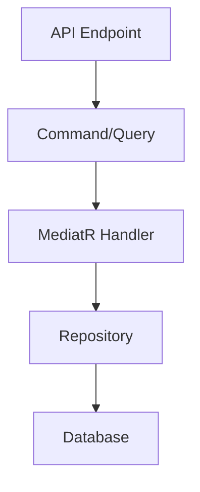

# Driver Management System


## Table of Contents
1. [Features](#features)
2. [Architecture](#architecture)
3. [Tech Stack](#tech-stack)
4. [API Endpoints](#api-endpoints)
5. [Getting Started](#getting-started)
6. [Development](#development)
7. [Testing](#testing)
8. [Deployment](#deployment)
9. [Contributing](#contributing)

## Features
### Core Features
- Complete CRUD operations for Driver management
- Soft delete implementation
- Audit logging (created/modified timestamps)
- Paginated listings with filtering
- Request validation

### Technical Features
- CQRS with MediatR
- Vertical Slice Architecture
- Repository Pattern with EF Core
- Docker-ready configuration
- Swagger API documentation

## Architecture

### Vertical Slice Structure
```
src/
├── Application/
│   └── Features/
│       ├── Drivers/
│       │   ├── AddDrivers/
│       │   ├── GetDrivers/
│       │   ├── EditDrivers/
│       │   └── DeleteDrivers/
├── Domain/
├── Infrastructure/
└── Web/
```

### CQRS Flow


## Tech Stack
| Component       | Technology             |
|-----------------|-----------------------|
| Backend         | .NET 9                |
| Database        | SQL Server            |
| ORM             | Entity Framework Core |
| Container       | Docker                |

## API Endpoints
| Endpoint           | Method | Description               |
|--------------------|--------|---------------------------|
| /api/drivers       | POST   | Create new driver         |
| /api/drivers       | GET    | List drivers (paginated)  |
| /api/drivers/{id}  | GET    | Get driver by ID          |
| /api/drivers/{id}  | PUT    | Update driver             |
| /api/drivers/{id}  | DELETE | Soft delete driver        |

## Getting Started

### Prerequisites
- .NET 7 SDK
- Docker Desktop
- SQL Server

### Installation
```bash
git clone https://github.com/3bda1137/Air-liquide.git
cd Air-liquide
docker-compose up -d
dotnet ef database update
dotnet run
```

## Development

### Common Commands
```bash
# Run with hot reload
dotnet watch run

# Add migration
dotnet ef migrations add <name>

# Apply migrations
dotnet ef database update
```

## Testing

### Run Tests
```bash
# Unit tests
dotnet test test/UnitTests

# Integration tests
dotnet test test/IntegrationTests

# With coverage
dotnet test --collect:"XPlat Code Coverage"
```

## Deployment

### Docker
```bash
docker-compose -f docker-compose.prod.yml up -d --build
```

## Contributing
1. Fork the repository
2. Create your feature branch
3. Commit your changes
4. Push to the branch
5. Open a pull request

## License
MIT
